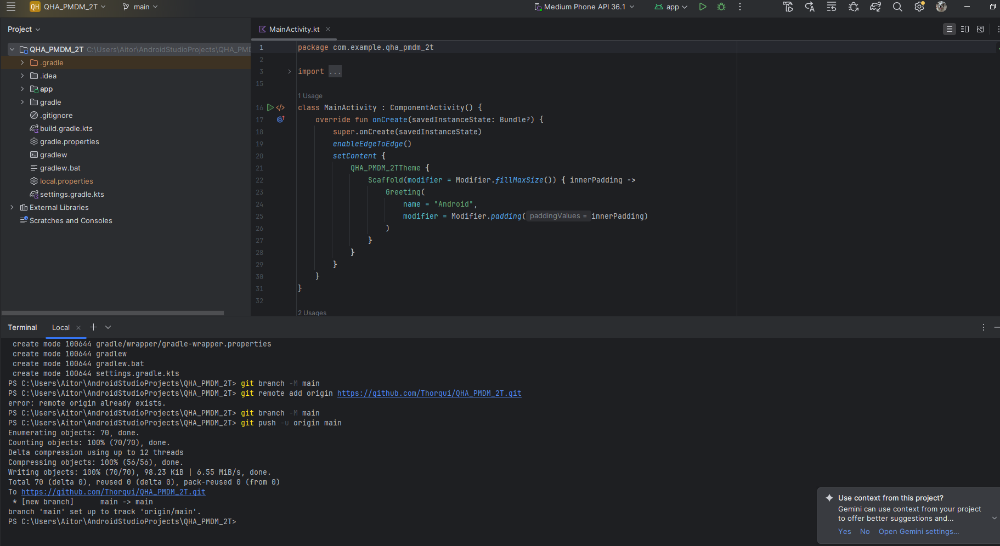
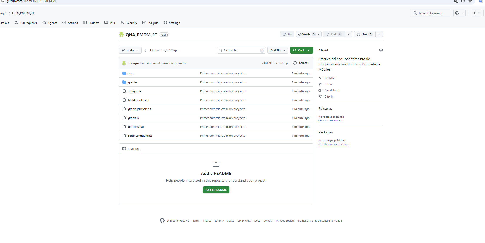
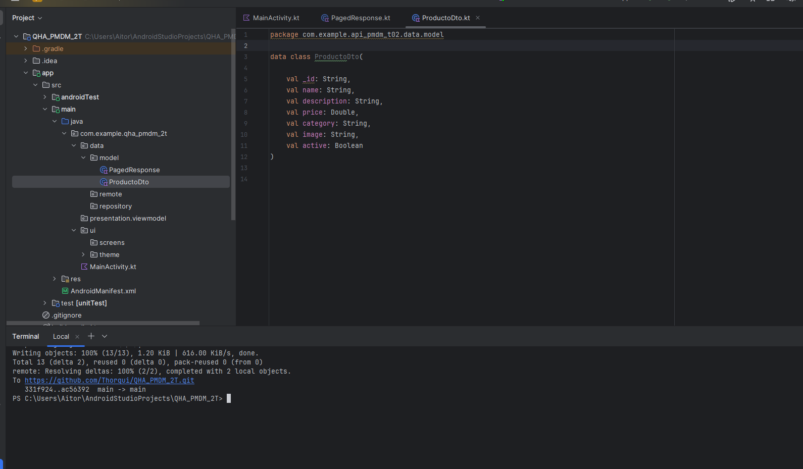
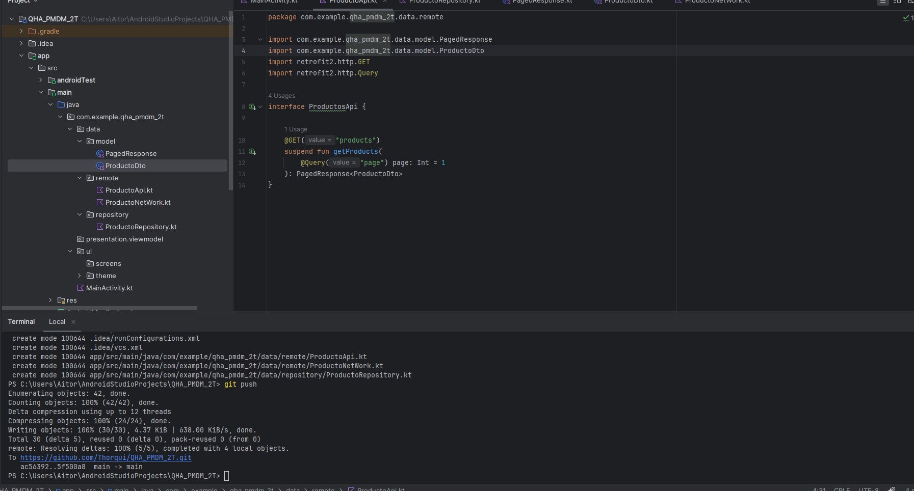
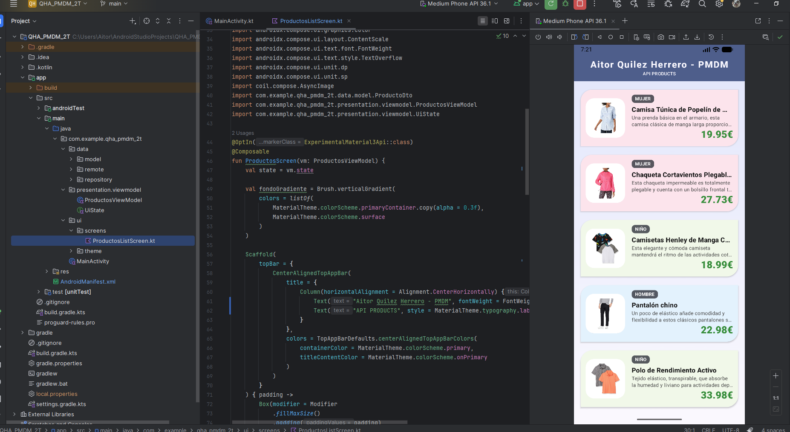

# 📱 QHA_PMDM - (API Rest)

Proyecto desarrollado para la asignatura de **Programación Multimedia y Dispositivos Móviles (PMDM)**. La aplicación consume datos de una API pública de productos y los muestra en una interfaz moderna utilizando tecnologías de vanguardia en Android.

## 🚀 Características

- **Consumo de API REST:** Petición única al endpoint de productos.
- **Arquitectura MVVM:** Separación clara entre datos, lógica de negocio y vista.
- **Jetpack Compose:** Interfaz 100% declarativa y reactiva.
- **Diseño Dinámico:** Cards con colores personalizados según la categoría del producto.
- **Gestión de Imágenes:** Carga asíncrona y eficiente mediante Coil.

## 🛠️ Stack Tecnológico

- **Lenguaje:** [Kotlin](https://kotlinlang.org/)
- **UI:** [Jetpack Compose](https://developer.android.com/jetpack/compose)
- **Red:** [Retrofit](https://square.github.io/retrofit/)
- **JSON Parsing:** [Moshi](https://github.com/square/moshi) (con Kotlin Json Adapter)
- **Carga de Imágenes:** [Coil](https://coil-kt.github.io/coil/)
- **Concurrencia:** Kotlin Coroutines & Flow

## 📂 Estructura del Proyecto

El proyecto sigue la estructura de **Clean Architecture** sugerida:

```text
com.example.api_pmdm_t02/
│
├── data/
│   ├── model/
│   │   ├── ProductoDto.kt       # Clase de datos para el objeto Producto
│   │   └── PagedResponse.kt    # Clase envoltorio para la respuesta de la API (results)
│   │
│   ├── remote/
│   │   ├── ProductosApi.kt     # Interfaz de Retrofit con los endpoints (@GET)
│   │   └── ProductosNetWork.kt # Cliente Retrofit configurado con Moshi
│   │
│   └── repository/
│       └── ProductosRepository.kt # Mediador entre la API y el ViewModel
│
├── presentation/
│   └── viewmodel/
│       ├── ProductosViewModel.kt # Gestión del estado de la UI y llamadas al repositorio
│       └── UiState.kt            # Sealed interface para estados: Loading, Success y Error
│
└── ui/
    ├── screens/
    │   └── ProductosScreen.kt    # UI principal y diseño de la Card (Composables)
    │
    ├── theme/
    │   ├── Color.kt             # Definición de la paleta de colores del proyecto
    │   ├── Theme.kt             # Configuración del tema Material 3 de la app
    │   └── Type.kt              # Configuración de tipografías
    │
    └── MainActivity.kt          # Punto de entrada: Configura EdgeToEdge y llama a la Screen
```
## 🔌 API Reference

La aplicación consume el siguiente endpoint para obtener el listado de productos:

`GET https://peticiones.online/api/products`

> **Nota importante:** Aunque la API devuelve metadatos de paginación (`page`, `per_page`, `total`, `total_pages`), este proyecto cumple estrictamente con el requisito de realizar una **única petición simple** al endpoint indicado, trabajando exclusivamente con el array de objetos contenido en el campo `results`.

---

## 📸 Capturas de Pantalla

<div align="center">
  <h3>📸 Vista General de la Aplicación</h3>
  
  <p><i>Creacion del proyecto</i></p>
</div>
<br>
<div align="center">
  <h3>🏷️ Detalle de Producto</h3>
  
  <p><i>Generacion archivos</i></p>
</div>
<br>
<div align="center">
  <h3>📸 Vista General de la Aplicación</h3>
  
<p><i>Generacion archivos</i></p>
</div>
<br>
<div align="center">
  <h3>🏷️ Detalle de Producto</h3>
  
<p><i>Generacion archivos</i></p>
</div>
<br>
<div align="center">
  <h3>📸 Vista General de la Aplicación</h3>
  
<p><i>Generacion archivos</i></p>
</div>
<br>
<div align="center">
  <h3>🏷️ Detalle de Producto</h3>
  
<p><i>Generacion archivos</i></p>
</div>
<br>
<div align="center">
  <h3>📸 Vista General de la Aplicación</h3>
  
  <p><i>Proyecto funcionando</i></p>
</div>
---

## 👷 Autor

* **Aitor Quilez Herrero** - *Desarrollo de Software Android* - Enlace a GitHub -> [https://github.com/Thorqui/QHA_PMDM_2T.git]

---